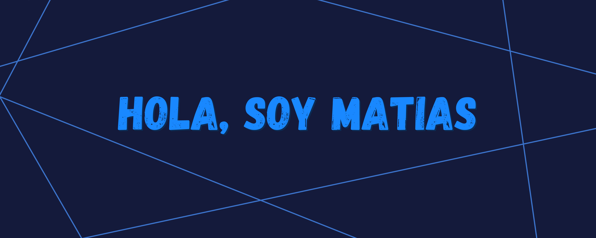

###### Hello, how are you
#    My [Web][website] here 👋

---

[][website]

 

### 🎯 skills

 
 
 
 

### 🚀 I’m currently learning
<ol>
<li> React</li>
<li> Node.js</li>
<li> English (https://discord.gg/63FUkwjTZa)</li>
</ol>

### 📚 My reading list
<ul>
<li> El libro negro del programador </li>
<li> Steve Jobs ( Author: Walter Isaacson )</li>
</ul>

### 🔭 I’m currently working on
<ul>
<li> Sendero Tecnologico website </li>
<li> Portfolio </li>
</ul>

<!-- ### 👯 I am looking for a job in -->

<!-- ### 🤔 I’m looking for help with -->

### 💬 questions about me

#### you know how to program a website
    Yes, although  depending on how difficult it is
 

### Contact me for
   I have a [discord](https://discord.gg/4FUtbhatAg)  
   Mail: [founder@sendero.tech](founder@sendero.tech)  
   Website: in development  

### Support me

<!-- Links -->
[website]: https://redes.sendero.tech/
[abilites]: https://redes.sendero.tech/
### Statistics

  <a href="https://github.com/MatiasBlanc">
  <a href="https://github.com/MatiasBlanc">

    
## My repos
    

  
   <a href="https://github.com/MatiasBlanc/Peso-Planetastico">
  <a href="https://github.com/MatiasBlanc/motorbike-sistem">
  <a href="https://github.com/MatiasBlanc/salobot-discord">
  <a href="https://github.com/MatiasBlanc/Canvas-con-teclas">
  <a href="https://github.com/MatiasBlanc/Canvas-con-teclas">
<a href="https://github.com/MatiasBlanc/Canvas-con-teclas">

