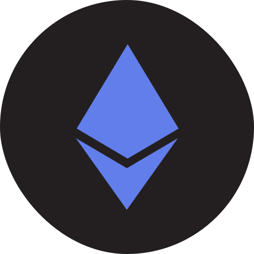
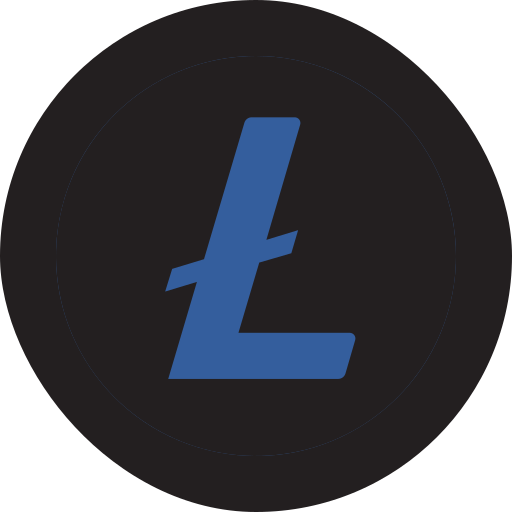
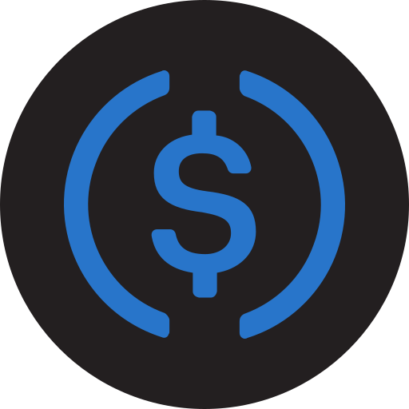

<!-- Social Media -->

# [ Hi, What’s up? 👋](https://matiasblanc.me/)
 

  
  

 

  

 

## 🎯 skills

  

  

## 🚀 I’m currently learning
<ol>
<li><a href="https://platzi.com/desarrollo-react/" target="_blank">React</a></li>
<li><a href="https://platzi.com/escuela-javascript/" target="_blank"> Node.js</li></a>
<li><a href="https://platzi.com/idioma-ingles/" target="_blank">English</li></a>
</ol>

## 📚 My reading list
<ul>
<li> Arsene Lupin </li>
<li> Steve Jobs ( Author: Walter Isaacson)</li>
</ul>

## 🔭 I’m currently working on
<ul>
  <li> Portfolio </li>
  <li> PsicoSpaces </li>
</ul>

 

## Support me

 

 Bitcoin: 3C2Q7GTUT1Syw4uVd9bUUXPjdkYYjtxRMi

 Ethereum: 0xa569c9c4a39d0b032cb37d4609cfa765a5a258c2

 Bitcoin Cash: 38gBFysYcwfDF73R64eiUiPJX9vGqGv8VA

 Litecoin: MKVKB6Xtijy4ntSYbPHv8VYkdB9F7YZbao

 USD Coin: 0xd9391c9848f1c58d0775834d05499f1609e0a2f8

## Listening

[[https://spotify-github-profile.vercel.app/api/view.svg?uid=dg3xvd6m0opk9slc6nzd7ife3&redirect=true][https://spotify-github-profile.vercel.app/api/view.svg?uid=dg3xvd6m0opk9slc6nzd7ife3&cover_image=true&theme=default&bar_color=1a1b27&bar_color_cover=true)]]

## Interesting repositories
#### Collaborator

<a href="https://github.com/unifay/curso-javascript">
<a href="https://github.com/SendTech/linktree-page">

